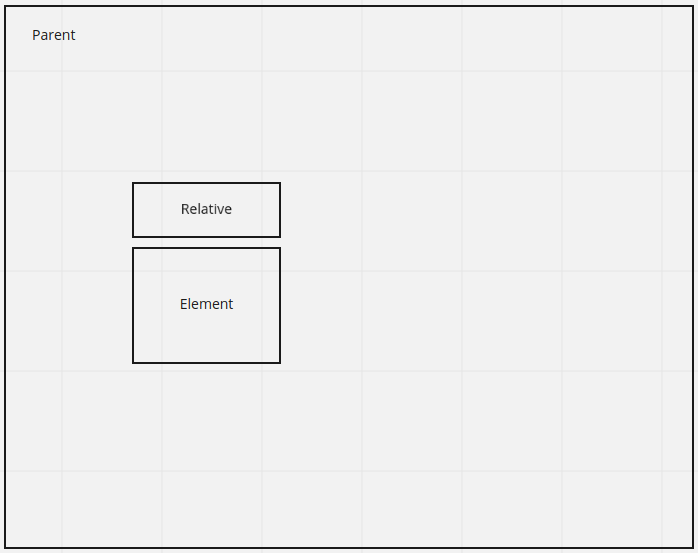
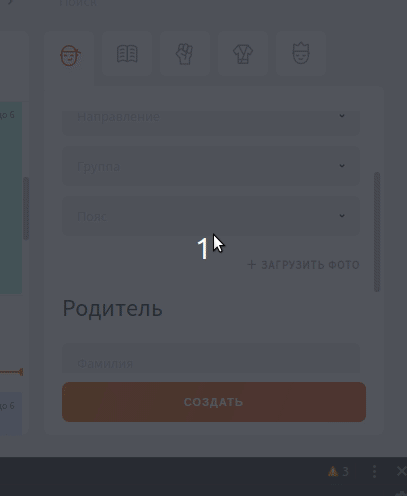
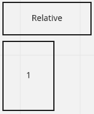
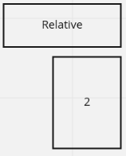
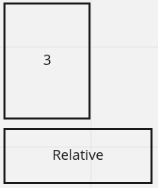
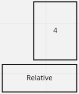
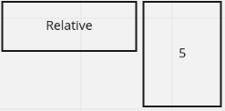
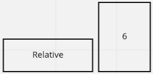
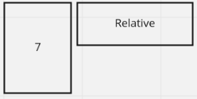
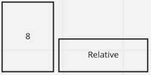

# ElementPositionLogic | Расчет позиции элемента
## Для чего
Есть необходимость позиционировать  элементы относительно контейнеров и
других элементов в различных направлениях.



Система выдает координаты элемента таки образом, чтобы он вместился в рамки между parent и 
relative:



## Как может позиционироваться элемент
Предусмотрено 8 позиций для элемента:










## Поведение
Функция принимает аргумент оси `Axis`, по которой необходимо позиционировать элемент относитльено
другого. Это может быть `x` или `y`.

Если ширины элемента не хватает для открытия по этой оси в каком-то из направлений, то
фунция попытается высчитать место для элемента с противоположной стороны.

**В случае, если ни с какой стороны не хватает места, то функция выберет наиболее выгодную (большую)
сторону и передаст измененные (уменьшеные) размеры элемента, чтобы появился скролл-бар**

## Использование (getElementRectAndPosition)
Функция **`getElementRectAndPosition`** принимает аргумент с интерфейсом:
```typescript
export interface IGetRectAndPositionElement {
  elements: IPositionElementVariables
  distance: IPositionElementDistance
  padding: IPositionElementPadding
  axis: Axis | 'xy'
  defaultOpenWay?: DefaultOpenWay
  elementOpenFlow?: ElementOpenFlow
}
```
**elements**:
```typescript
/**
 * .getBoundedRect()
 * @param element Открываемый элемент
 * @param parent Контейнер элемента
 * @relative Относительный элемент, относительно которого будет позиционироваться element
 */
export interface IPositionElementVariables {
  element: ElementSizes
  parent: ElementSizes
  relative: ElementSizes
}
```
```typescript
export type ElementSizes = ClientRect | DOMRect
```
`ClientRect | DOMRect` можно получить с помощью функции `.getBoundedRect()`, применяемой к
`HTMLElement`

**distance**:
```typescript
/**
 * @description Дистанция между relative и element
 */
export interface IPositionElementDistance {
  x: number
  y: number
}
```

**padding**:
```typescript
/**
 * @description Дистанция между element и parent
 */
export interface IPositionElementPadding {
  x: number
  y: number
}
```

**axis**:
```typescript
export type Axis = 'x' | 'y'
```
Направление открытия элемента

**defaultOpenWay**
```typescript
/**
 * @description Стандартное направление открытия.
 * По умолчанию - after.
 * При axis=y и DefaultOpenWay=after элемент будет открывать под relativeEl
 * При axis=y и DefaultOpenWay=before элемент будет открывать над relativeEl
 */
export type DefaultOpenWay = 'before' | 'after'
```

**elementOpenFlow**:
```typescript
/**
 * @description Направление открытие относительно relativeEl:
 * start при axis=x - с верхнего правого угла вниз
 * start при axis=y - с нижнего левого угла вниз
 * end при axis=x - с нижнего правого угла вверх
 * end при axis=y - с верхнего правого угла вниз
 */
export type ElementOpenFlow = 'start' | 'end'
```

elementOpenFlow отвечает за разницу межну 1 и 2 положением элемента:

elementOpenFlow = start: 
elementOpenFlow = end: 

## Результат

Возвращается объект с интерфейсом `ClientRect`:
```typescript
interface ClientRect {
    bottom: number;
    readonly height: number;
    left: number;
    right: number;
    top: number;
    readonly width: number;
}
```

